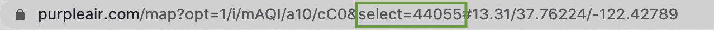
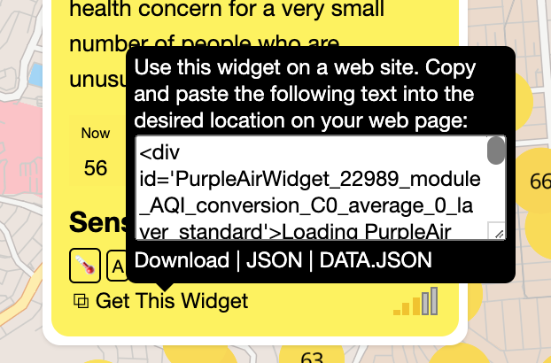

# AQIDuck (WIP)


### This will:

* Pull data from PurpleAir
* Report to Slack about air quality and temperature based on the channel topic
* Monitor AQI to let you know when it's safe to go outside or no longer safe to go outside

### Future additions:

* Pull data from Awair and Google Home (once Google Home becomes available for individual use)
* Monitor temp on an outdoor and an indoor sensor to let you know when it's cool enough to open the windows to cool down the house

### To install:

* Pull the code down onto your server
* Bundle running `yarn install` and run `yarn build-ts` to build the typescript files
* Get a PurpleAir API Key
* create a slackbot with the permissions `app_mentions:read`, `channels:read`, `chat:write`, `groups:read`
* Set up slack event subscriptions:
  - expose a port and calling: `./node_modules/.bin/slack-verify --secret [Signing secret] --port [you pick the port, default 3000]`
  - Put the URL of your app in the Event subscriptions part of the slack setup
  - You can find the signing secret in the basic information part of your slack setup
  - Subscribe to the events `app_mention`, `channel_left`, `member_joined_channel`
  - cancel the `slack-verify` server so you can use that same port for the bot
* Make sure you have all the environment variables set up listed in the example.env
* Currently you have to setup the JSON and invite the slack user for your bot to all the channels before you start the server
* Start the server using `node .` or running the `dist/index.js` file


### To set up:
* invite the slackbot to various channels
* set the channel topic to include a JSON string about which PurpleAir sensors should be monitored, for example:
```
Whatever channel topic you want to write

***{"sensors": [{"name": "Sesame Street", "type": "PurpleAir", "id": 12345}]}***
```

If you want your sensor to monitor specific AQI thresholds, add thresholds to the topic JSON like so:
`{"sensors": [{"name": "Whatever", "type": "PurpleAir", "id": 12345, "AQIThresholds":[50,80]}]}`
Note this currently doesn't validate that the first number is less than the second, and only looks at the first two items.

If you want your sensor to monitor whenever the AQI goes up or down by 5, add thresholds to the topic JSON like so:
`{"sensors": [{"name": "Whatever", "type": "PurpleAir", "id": 12345, "AQIMonitoring":"dynamic"}]}`

### To talk to the bot:

* `@AQIDuck report` gives you the report
* `@AQIDuck stop monitoring` stops the monitoring
* `@AQIDuck resume monitoring` resumes the monitoring
* `@AQIDuck hello` says hi

### To find your PurpleAir sensor ID:

* On the PurpleAir map, click on the sensor you're interested in
* The sensor ID will be in the URL:

* At the bottom of the widget with the air quality, hover over "Get This Widget"
* The ID in the div of the widget also contains the sensor ID


